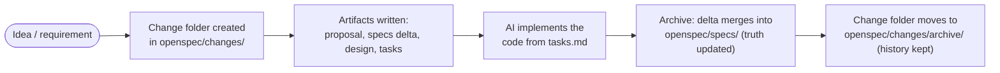
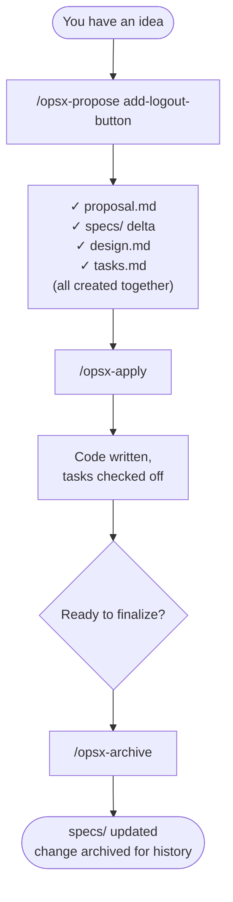
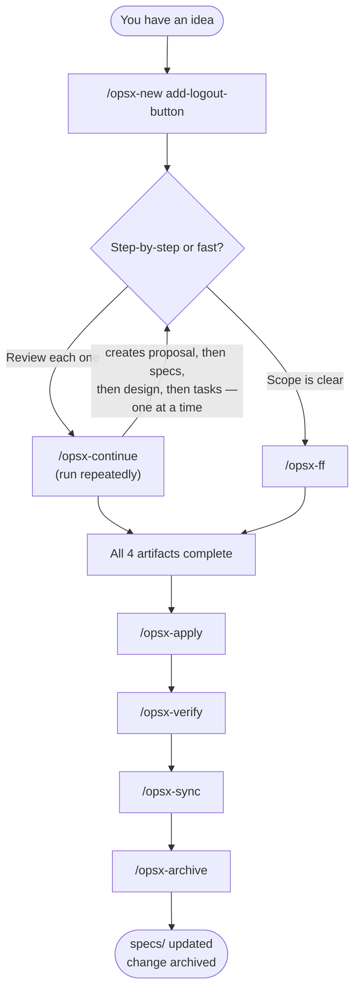

# OpenSpec with GitHub Copilot — A Beginner's Training Guide

A from-scratch introduction to OpenSpec, written for someone who has never used it before. Every factual claim below is sourced from the official Fission-AI/OpenSpec documentation and repository (links at the end) — nothing is invented.

---

## 1. Introduction — What Is OpenSpec and Why It Exists

OpenSpec describes itself as **spec-driven development (SDD) for AI coding assistants**. The core problem it solves: when you ask an AI coding assistant to "build a feature" directly, you get code immediately — but no record of *why* it was built that way, *what* was actually agreed to, or *how* it was designed, before the code existed. OpenSpec inserts a structured planning stage between your idea and the AI writing code, so that intent, requirements, and design are captured as reviewable documents first.

How OpenSpec positions itself against the alternatives, directly from its own documentation: compared to **GitHub Spec Kit**, OpenSpec is lighter — Spec Kit is described as thorough but heavyweight, with rigid phase gates and a Python setup, while OpenSpec lets you iterate freely. Compared to **AWS Kiro**, which is powerful but locks you into one IDE and Claude models only, OpenSpec works with the tools you already use — including GitHub Copilot. And compared to plain prompting with no spec process at all, OpenSpec's stated goal is to bring predictability without the ceremony.

In short: **OpenSpec is a lightweight, tool-agnostic layer that makes an AI coding assistant plan before it builds, and keeps that plan as a permanent, auditable record.**

---

## 2. The Two Folders That Make Up the System

Everything in OpenSpec lives under one directory: `openspec/`. Inside it are two folders with very different jobs:

```
openspec/
├── specs/              ← Source of truth: how the system behaves TODAY
│   ├── auth/
│   └── payments/
├── changes/             ← Proposed work, one folder per change, not yet final
│   └── add-logout-button/
│       ├── proposal.md
│       ├── specs/        ← a DELTA, not a copy — what's changing
│       ├── design.md
│       └── tasks.md
└── changes/archive/      ← completed changes, kept permanently for history
    └── 2026-06-18-add-logout-button/
```

`specs/` is the accepted, current truth. `changes/` is a workbench for things that are proposed but not yet merged into that truth. When a change is finished, its content merges into `specs/` and the change folder itself moves into `changes/archive/` — it is never deleted, only relocated, which preserves a full audit trail of every decision ever made.



---

## 3. The Four Artifacts — What Each One Actually Answers

Every change folder is built from up to four documents, each answering a different question:

| Artifact | Question it answers | Contains |
|---|---|---|
| `proposal.md` | **Why** are we doing this, and **what** is changing? | Intent, scope, approach |
| `specs/` (delta) | **What exactly** is the new/changed behavior? | Requirements with Given/When/Then scenarios, marked as ADDED, MODIFIED, or REMOVED |
| `design.md` | **How** will it be built, technically? | Technical approach, architecture decisions |
| `tasks.md` | **What steps**, in order, build it? | An implementation checklist with checkboxes |

The delta spec is the concept most people new to OpenSpec find confusing at first: it is **not** a second copy of your main spec. It's a diff — a document that says, relative to the current accepted spec, exactly what's being added, modified, or removed. That's what gets merged into `openspec/specs/` later.

These artifacts aren't a rigid, one-way pipeline either. The documentation describes an action-based workflow: you can edit any artifact at any point as you learn more — there's no penalty for going back to fix an earlier one after starting on a later one.

---

## 4. Setting This Up for GitHub Copilot

Install the CLI once per machine:
```
npm install -g @fission-ai/openspec
```

Initialize it inside your project, telling it explicitly to configure for Copilot:
```
openspec init --tools github-copilot
```

This generates Copilot-specific scaffolding: skill files under `.github/skills/openspec-*/SKILL.md` and prompt files under `.github/prompts/opsx-<id>.prompt.md`. These prompt files are what let you type slash commands like `/opsx-propose` directly inside Copilot Chat.

**Important syntax note specific to Copilot:** the official docs use colon syntax (`/opsx:propose`) as their canonical reference notation, but the actual typed command differs by tool. **GitHub Copilot (IDE) uses a hyphen, not a colon: `/opsx-propose`, `/opsx-apply`, `/opsx-archive`.** Also note: GitHub Copilot prompt files only work inside IDE extensions — VS Code, JetBrains, Visual Studio. Copilot CLI does not consume them.

---

## 5. Core Profile — Your Starting Point

When you run `openspec init`, you get the **core profile** by default. As of current OpenSpec releases, core includes five commands: **propose, explore, apply, sync, and archive.** (Earlier OpenSpec versions shipped core without `sync`; it was added to the default set in a more recent release, so if you're referencing older articles or screenshots, you may see only four.)

| Command | What it does | Produces |
|---|---|---|
| `/opsx-explore` | A thinking-partner conversation — investigate, compare options | Nothing on disk |
| `/opsx-propose` | The main starting command — does everything in one step | `proposal.md`, delta `specs/`, `design.md`, `tasks.md`, all at once |
| `/opsx-apply` | Implements the code | Working code; checks off `tasks.md` items |
| `/opsx-sync` | Merges the delta spec into the main `specs/` without archiving yet | Updated `openspec/specs/`; change folder stays active |
| `/opsx-archive` | Finalizes everything | Moves the change folder to `changes/archive/`; merges specs if not already synced |

### A Core Profile Walkthrough



This is the fastest path: one command to plan, one to build, one to finalize. It's the right default for most day-to-day changes, especially smaller ones where you don't need to pause and review each artifact separately.

---

## 6. Expanded Profile — More Checkpoints, More Control

Expanded profile is **not a replacement** for core — it's an opt-in addition that unlocks six more commands: `new`, `continue`, `ff`, `verify`, `bulk-archive`, and `onboard`. Enable it with:
```
openspec config profile
openspec update
```
You can select any subset of all available commands — not strictly "core" or "expanded" as two locked buckets — so you could enable just `verify` and `continue` without taking everything else.

| Command | What it does | Produces |
|---|---|---|
| `/opsx-new` | Scaffolds a change folder only | An empty folder + `.openspec.yaml` metadata — no content artifacts yet |
| `/opsx-continue` | Creates exactly one artifact at a time, in dependency order | One artifact per run, letting you review/edit before the next is generated |
| `/opsx-ff` | "Fast-forward" — creates all remaining planning artifacts at once | Same end result as `propose`, used after `new` |
| `/opsx-verify` | Checks implementation against the artifacts for Completeness, Correctness, and Coherence | A report only (no files changed); flags CRITICAL / WARNING / SUGGESTION issues; does **not** block archiving |
| `/opsx-bulk-archive` | Archives several finished changes together | Resolves spec conflicts between them by checking the actual codebase; archives in chronological order |
| `/opsx-onboard` | A guided, narrated tutorial run through the entire cycle on your real codebase | Used for learning, not regular work |

### An Expanded Profile Walkthrough



Use expanded profile when you want a pause point after each planning artifact (catching a wrong proposal before design and tasks get built on top of it), or when you specifically need the `verify` check before signing off on a change — useful in regulated or audit-conscious environments.

---

## 7. Telling OpenSpec About Your Project — `config.yaml`

Running `openspec init` offers to walk you through creating `openspec/config.yaml` interactively; it can also be hand-edited at any time. It does three things: sets a default schema, injects project context into every artifact generated, and lets you add rules scoped to a specific artifact type only.

```yaml
schema: spec-driven

context: |
  Tech stack: Java 17, Spring Boot 3.x, Azure/AKS
  Use Lombok annotations; avoid explicit boilerplate getters/setters

rules:
  proposal:
    - Identify compliance/audit impact
  specs:
    - Use Given/When/Then format
  design:
    - Include sequence diagrams for complex flows
```

Context is injected into **every** artifact; rules under a specific key (like `design:`) only apply when that specific artifact is being generated — so a `design` rule won't leak into `tasks.md` generation.

---

## 8. Quick Reference — Every Command at a Glance

| Command | Profile | One-line purpose |
|---|---|---|
| `/opsx-explore` | Core | Think it through, no files created |
| `/opsx-propose` | Core | Generate all 4 planning artifacts at once |
| `/opsx-apply` | Core | Write the code |
| `/opsx-sync` | Core | Merge delta specs into main specs, stay active |
| `/opsx-archive` | Core | Finalize and move to history |
| `/opsx-new` | Expanded | Scaffold an empty change folder |
| `/opsx-continue` | Expanded | Build one artifact at a time |
| `/opsx-ff` | Expanded | Build all remaining artifacts at once |
| `/opsx-verify` | Expanded | Audit implementation vs. artifacts |
| `/opsx-bulk-archive` | Expanded | Archive multiple finished changes together |
| `/opsx-onboard` | Expanded | Guided tutorial on your own codebase |

---

## Sources

- https://github.com/Fission-AI/OpenSpec/
- https://github.com/Fission-AI/OpenSpec/blob/main/docs/getting-started.md
- https://github.com/Fission-AI/OpenSpec/blob/main/docs/commands.md
- https://github.com/Fission-AI/OpenSpec/blob/main/docs/workflows.md
- https://github.com/Fission-AI/OpenSpec/blob/main/docs/customization.md
- https://github.com/Fission-AI/OpenSpec/blob/main/docs/supported-tools.md
- https://github.com/Fission-AI/OpenSpec/blob/main/docs/opsx.md
- https://github.com/Fission-AI/OpenSpec/releases
- https://github.com/Fission-AI/OpenSpec/issues/439
